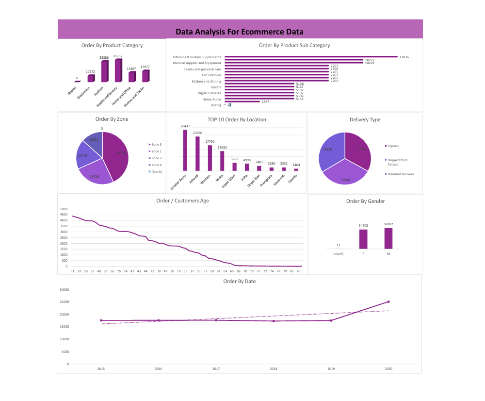

E-commerce Sales Analysis (5-Year Data)

​📌 Project Overview

​This project involves a comprehensive analysis of e-commerce sales data spanning over five years. The primary goal was to uncover sales trends, identify high-performing categories, and provide actionable insights to optimize business growth and inventory management.

​🛠️ Tools & Technologies

​Microsoft Excel: The core tool used for data processing and visualization.

​Power Query: Used for data cleaning and transformation (ETL).

​Pivot Tables & Charts: Used for summarizing complex data points.

​Dynamic Dashboard: Created to provide a high-level visual summary of Key Performance Indicators (KPIs).

​🔍 Key Analysis Features

​Time Series Analysis: Identifying seasonal patterns and yearly growth rates.

​Product Performance: Ranking products and categories based on total revenue and profit margins.

​Regional Insights: Mapping sales distribution across different geographical locations.

​Customer Behavior: Analyzing order frequency and average order value (AOV).

​💡 Key Insights

​Identified a 20% year-over-year growth in sales, driven primarily by the "Electronics" category.

​Seasonal peaks were consistently observed in Q4 (November & December), suggesting the need for higher stock levels during this period.

​Optimized the shipping strategy by identifying regions with the highest delivery delays.

​📊 Visualizations

​Below is a preview of the interactive dashboard developed for this project:

​
